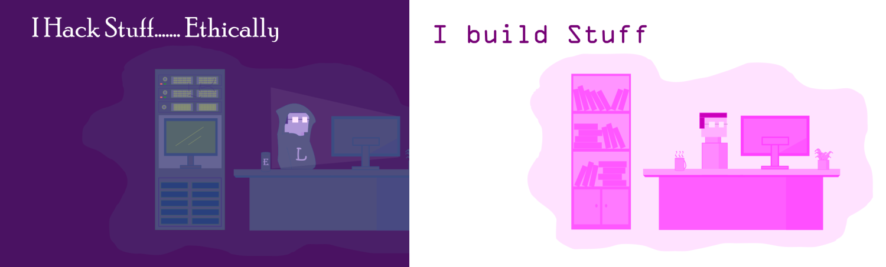

# Hello There 

My name is leonlit, it's a nickname of course. I create software, websites and applications. Both terminal and GUI. Currently in my final year of my Computer Science Degree, majoring in network security. For more info, visits my [portfolio website](https://leonlit.github.io)

Follow me on [![Twitter][1.2]][1], or 

[1.2]: https://i.imgur.com/wWzX9uB.png (twitter icon without padding)
[1]: https://twitter.com/leonlit

 
 

 
 

 

